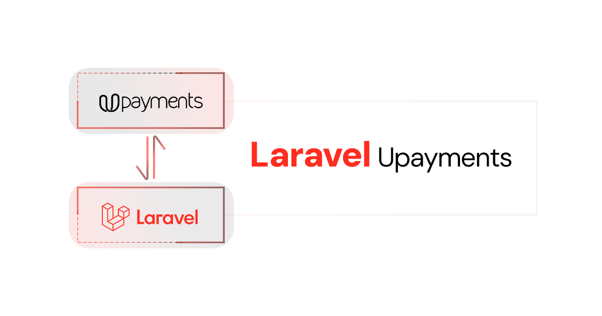

# Laravel Upayment Integration

A Laravel package for integrating the Upayment payment gateway. It provides a convenient way to interact with the Upayment API, allowing you to create payments, refunds, manage cards, and more.

<!-- Full-width image -->
<p align="center">
  
</p>


## Installation

1. **Require the package using Composer:**

   Run the following command in your terminal:

    ```bash
   composer require osa-eg/laravel-upayments
   ```

2. **Publish the configuration file:**

    ```bash
    php artisan vendor:publish --provider="Osama\Upayments\Providers\UpaymentsServiceProvider" --tag="config"
    ```

3. **Configure your environment:**

   Update your `.env` file with the following:

    ```dotenv
    UPAYMENTS_API_KEY=your_upayments_api_key
    UPAYMENTS_API_URL=https://sandboxapi.upayments.com/api/v1
    UPAYMENTS_LOGGING_CHANNEL=stack
    UPAYMENTS_LOGGING_ENABLED=true
   ```

## Configuration

After publishing, the configuration file config/upayments.php will be created. You can modify it according to your needs.
```php
<?php

return [
    'api_key'           => env('UPAYMENTS_API_KEY', ''), // Your Upayments API key
    'api_base_url'      => env('UPAYMENTS_API_URL', 'https://sandboxapi.upayments.com'),
    'logging_channel'   => env('UPAYMENTS_LOGGING_CHANNEL', 'stack'),
    'logging_enabled'   => env('UPAYMENTS_LOGGING_ENABLED', true),
];
```

### Configuration Options

- `api_key`: Your Upayments API key.
- `api_base_url`: The base URL for the Upayments API. Use the sandbox URL for testing.
- `logging_channel`: Specifies the logging channel to be used for logging requests and responses. Default is `'stack'`.
- `logging_enabled`: Enables or disables logging. Set to `true` to enable logging or `false` to disable it.

### Logging

The package includes logging functionality to help you debug and monitor API requests and responses.

- `Enabling/Disabling` Logging: You can enable or disable logging by setting the UPAYMENTS_LOGGING_ENABLED value in your .env file to true or false.
- `ging Channel`: Specify the logging channel in your .env file using UPAYMENTS_LOGGING_CHANNEL. This should correspond to a channel defined in your config/logging.php file.

Example Logging Configuration

In your .env file:
```dotenv
UPAYMENTS_LOGGING_CHANNEL=upayments
UPAYMENTS_LOGGING_ENABLED=true
```
In your config/logging.php:
```php
'channels' => [
    // Other channels...
    'upayments' => [
        'driver' => 'single',
        'path' => storage_path('logs/upayments.log'),
        'level' => 'info',
    ],
],
```
## Usage

### Basic Usage

1. **Add a product and create a payment:**

    ```php
    use Upayment;

    $response = Upayments::addProduct('Test Product', 'Description', 100.0, 1)
        ->setOrder([
            'id' => 'ORD123',
            'reference' => 'REF123',
            'description' => 'Order Description',
            'currency' => 'USD',
            'amount' => 100.0,
        ])
        ->setCustomer([
            'uniqueId' => 'CUST123',
            'name' => 'John Doe',
            'email' => 'john.doe@example.com',
            'mobile' => '+1234567890',
        ])
        ->setPaymentGateway('knet')
        ->setReturnUrl('https://example.com/return')
        ->setCancelUrl('https://example.com/cancel')
        ->setNotificationUrl('https://example.com/notify')
        ->setReference('REF123')
        ->setLanguage('en')
        ->createPayment();
    
    if ($response['status']) {
        echo "Payment link: " . $response['data']['link'];
    } else {
        echo "Error: " . $response['error']['message'];
    }
    ```

2. **Retrieve payment status:**

    ```php
    $response = Upayments::getPaymentStatus('ORD123', 'trackId');
    ```

3. **Create a refund:**

    ```php
    $response = Upayments::createRefund('ORD123', 50.0, [
        'customerFirstName' => 'John',
        'customerEmail' => 'john.doe@example.com',
        'reference' => 'REF12345',
        'notifyUrl' => 'https://example.com/refund-notify'
    ]);
    ```

4. **Multi-vendor refund:**

    ```php
    $response = Upayments::addRefundVendor([
            'refundRequestId' => 'REF123',
            'ibanNumber' => 'KW91KFHO0000000000051010173254',
            'totalPaid' => '100.0',
            'refundedAmount' => 0.0,
            'remainingLimit' => 100.0,
            'amountToRefund' => 10.0,
            'merchantType' => 'vendor'
        ])
        ->addRefundVendor([
            'refundRequestId' => 'REF124',
            'ibanNumber' => 'KW31NBOK0000000000002010177457',
            'totalPaid' => '200.0',
            'refundedAmount' => 0.0,
            'remainingLimit' => 200.0,
            'amountToRefund' => 20.0,
            'merchantType' => 'vendor'
        ])
        ->createMultiVendorRefund('ORD123', [
            'reference' => 'REF12345',
            'notifyUrl' => 'https://example.com/multi-refund-notify'
        ]);
    ```

## Available Methods

### Payment Methods

- `addProduct($name, $description, $price, $quantity)`
- `setOrder($orderData)`
- `setCustomer($customerData)`
- `setPaymentGateway($source)`
- `setReturnUrl($url)`
- `setCancelUrl($url)`
- `setNotificationUrl($url)`
- `createPayment()`
- `getPaymentStatus($id, $type = 'invoiceId')`
- `checkPaymentButtonStatus()`

### Refund Methods

- `createRefund($orderId, $totalPrice, array $optionalParams = [])`
- `getRefundStatus($orderId)`
- `checkSingleRefundStatus($orderId)`
- `deleteRefund($orderId, $refundOrderId)`

### Multi-Vendor Methods

- `addRefundVendor(array $vendorData)`
- `createMultiVendorRefund($orderId, array $optionalParams = [])`
- `deleteMultiVendorRefund($generatedInvoiceId, $orderId, $refundOrderId, $refundArn)`

### Card Management Methods

- `createCustomerUniqueToken($customerUniqueToken)`
- `addCard($returnUrl, $customerUniqueToken)`
- `retrieveCustomerCards($customerUniqueToken)`

## Middleware Support

The package includes retry and logging middleware to handle request retries and log requests for debugging purposes.

## Unit Tests

To run the tests, use the following command:

```bash
vendor/bin/phpunit
```
## Contributing

Feel free to submit issues or pull requests for improvements and bug fixes.

## License

The Laravel Upayment Integration package is open-sourced software licensed under the MIT license.

```
This `README.md` provides comprehensive documentation on how to use the package, including installation, configuration, usage examples, and available methods. It serves as a guide for integrating and utilizing the Laravel Upayment Integration package effectively.
```